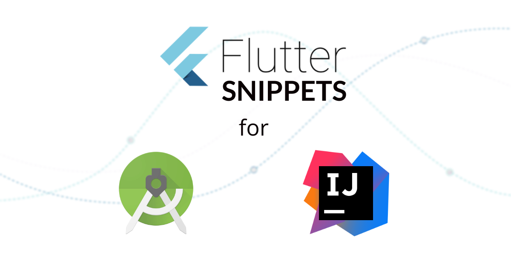

# Flutter Snippets

An Intellij & Android Studio plugin that adds Live Templates to your IDE saving time writing the boilerplate in Flutter.

## Available Snippets
### Generic
| Shortcut|Expanded|Description|Flutter Docs| 
| ---------- | ----------| -------------- | -------------- |
|`animatedBldr`|Animated Builder|Creates an Animated Builder. The child widget  is passed to the builder|[View Docs](https://docs.flutter.io/flutter/widgets/AnimationBuilder-class.html)|
|`aspectRatio`| AspectRatio |Creates an AspectRatio|[View Docs](https://api.flutter.dev/flutter/widgets/AspectRatio-class.html)|
|`build`|Build Method|Describes the part of the user interface represented by the widget.| |
|`column`| Column |Creates a Column Widget|[View Docs](https://docs.flutter.io/flutter/widgets/Column-class.html)|
|`container`| Container |Creates a Container Widget|[View Docs](https://docs.flutter.io/flutter/widgets/Container-class.html)|
|`customClipper`|Custom Clipper|Used for creating custom shapes|[View Docs](https://api.flutter.dev/flutter/rendering/CustomClipper-class.html)|
|`customPainter`|Custom Painter|Used for creating custom paint|[View Docs](https://api.flutter.dev/flutter/rendering/CustomPainter-class.html)|
|`customScrollV`| Custom ScrollView|Creates a ScrollView that creates custom scroll effects using slivers. If the primary argument is true, the controller must be null.|[View Docs](https://api.flutter.dev/flutter/widgets/CustomScrollView-class.html)|
|`debugP`|Debug Print|Prints a message to the console, which you can access using the flutter tool'slogscommand (flutter logs).|[View Docs](https://api.flutter.dev/flutter/foundation/debugPrint.html)|
|`dis`|Dispose|Called when this object is removed from the tree permanently. The framework calls this method when this State object will never build again.|[View Docs](https://api.flutter.dev/flutter/widgets/State/dispose.html)|
|`futureBldr`|Future Builder|Creates a Future Builder. This builds itself based on the latest snapshot of interaction with a Future|[View Docs](https://docs.flutter.io/flutter/widgets/FutureBuilder-class.html)|
|`initS`|InitState|Called when this object is inserted into the tree. The framework will call this method exactly once for each State object it creates.|[View Docs](https://api.flutter.dev/flutter/widgets/State/initState.html)|
|`layoutBldr`|Layout Builder|Similar to the Builder widget except that the framework calls the builder function at layout time and provides the parent widget's constraints.|[View Docs](https://api.flutter.dev/flutter/widgets/LayoutBuilder-class.html)|
|`listViewBldr`|ListView.Builder|Creates a scrollable, linear array of widgets that are created on demand.Providing a non-null itemCount improves the ability of the ListView to estimate the maximum scroll extent.|[View Docs](https://docs.flutter.io/flutter/widgets/ListView.builder.html)| 
|`mounted`|Mounted|Whether this State object is currently in a tree.|[View Docs](https://api.flutter.dev/flutter/widgets/State/mounted.html)| 
|`nosm`|No Such Method|This method is invoked when a non-existent method or property is accessed.|[View Docs](https://api.flutter.dev/flutter/dart-core/Object/noSuchMethod.htmll)| 
|`orientationBldr`|Orientation Builder|Creates a builder which allows for the orientation of the device to be specified and referenced|[View Docs](https://api.flutter.dev/flutter/widgets/OrientationBuilder-class.html)|
|`reassemble`|Reassemble|Called whenever the application is reassembled during debugging, for example during hot reload.|[View Docs](https://api.flutter.dev/flutter/widgets/State/reassemble.html)|
|`row`| |Creates a Row Widget|[View Docs](https://docs.flutter.io/flutter/widgets/Row-class.html)|
|`showDialog`|Alert Dialog |Creates a showDialog that returns with AlertDialog|[View Docs](https://docs.flutter.io/flutter/widgets/AlertDialog-class.html)|
|`singleChildSV`|Single Child Scroll View|Creates a scroll view with a single child|[View Docs](https://api.flutter.dev/flutter/widgets/SingleChildScrollView-class.html)|
|`snk`|Sink|A Sink is the input of a stream.|[View Docs](https://api.dartlang.org/stable/dart-async/StreamController-class.html)|
|`streamBldr`| Stream Builder |Creates a new StreamBuilder that builds itself based on the latest snapshot of interaction with the specified stream |[View Docs](https://docs.flutter.io/flutter/widgets/StreamBuilder-class.html)|
|`statefulBldr`|Stateful Builder|Creates a widget that both has state and delegates its build to a callback. Useful for rebuilding specific sections of the widget tree.|[View Docs](https://api.flutter.dev/flutter/widgets/StatefulBuilder/StatefulBuilder.html)|
|`strm`|StreamController|A source of asynchronous data events. A stream can be of any data type.|[View Docs](https://api.dartlang.org/stable/dart-async/StreamController-class.html)|
|`subj`|BehaviorSubject|A BehaviorSubject is also a broadcast StreamController which returns an Observable rather than a Stream.|[View Docs](https://pub.dev/documentation/rxdart/latest/rx/BehaviorSubject-class.html)|
|`txt`| Text |Creates a Text Widget|[View Docs](https://docs.flutter.io/flutter/widgets/Text-class.html)|
|`toStr`|To String|Returns a string representation of this object.|[View Docs](https://docs.flutter.io/flutter/widgets/Text-class.html)|
|`tweenAnimationBldr`|Tween Animation Builder|Widget builder that animates a property of a Widget to a target value whenever the target value changes.|[View Docs](https://api.flutter.dev/flutter/animation/Tween-class.html)|
|`valueListenableBldr`|Value Listenable Builder |Given a ValueListenable and a builder which builds widgets from concrete values of T, this class will automatically register itself as a listener of the ValueListenable and call the builder with updated values when the value changes.|[View Docs](https://api.flutter.dev/flutter/widgets/ValueListenableBuilder-class.html)|

### Cupertino Specific
| Shortcut| Expanded | Description| Flutter Docs |
| ---------- | ------------------------ | -------|------------- |
|`cupeApp`|Cupertino App |Create a New Cupertino App| [View Docs](https://api.flutter.dev/flutter/cupertino/CupertinoApp-class.html)|
|`importC`| Cupertino Package|Import Cupertino package.| [View Docs](https://api.flutter.dev/flutter/cupertino/cupertino-library.html)|
### Material Specific
| Shortcut| Expanded | Description| Flutter Docs |
| ---------- | ------------------------ | -------|------------- |
|`importM`| Material Package |Import Material package|[View Docs](https://api.flutter.dev/flutter/material/material-library.html)|
|`mateApp`| Material App |Create a new Material App|[View Docs](https://api.flutter.dev/flutter/material/MaterialApp-class.html) | 
|`scfAll`| Scaffold |Creates a Scaffold containing an Appbar, BottomNavigationBar and FloatingActionButton|[View Docs](https://docs.flutter.io/flutter/material/Scaffold-class.html)| 
|`scfAppBar`| Scaffold |Creates a Scaffold containing an Appbar| |
|`scfAppBarFab`| Scaffold |Creates a Scaffold containing an Appbar and Floating Action Button| |
|`scfAppBarBtmNav`| Scaffold |Creates a Scaffold containing an Appbar and Bottom Navigation Bar||

## Plugin Supports the Following IDEs:
* Android Studio
* IntelliJ IDEA Ultimate
* IntelliJ IDEA Community
* IntelliJ IDEA Educational

